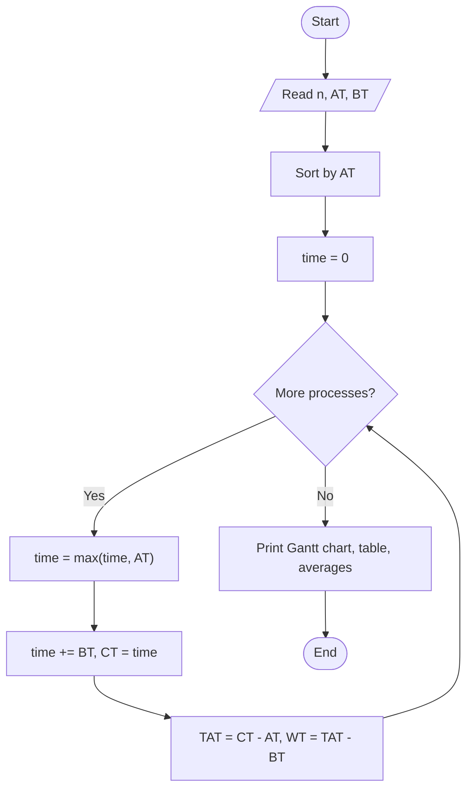

# FCFS Scheduling

Run processes in order of arrival time. Each process runs to completion.

```mermaid
flowchart TD
    A([Start]) --> B[/"Read n, AT, BT"/]
    B --> C["Sort by AT"]
    C --> D["time = 0"]
    D --> E{"More processes?"}
    E -- Yes --> F["time = max(time, AT)"]
    F --> G["time += BT, CT = time"]
    G --> H["TAT = CT - AT, WT = TAT - BT"]
    H --> E
    E -- No --> I["Print Gantt chart, table, averages"]
    I --> J([End])
```
