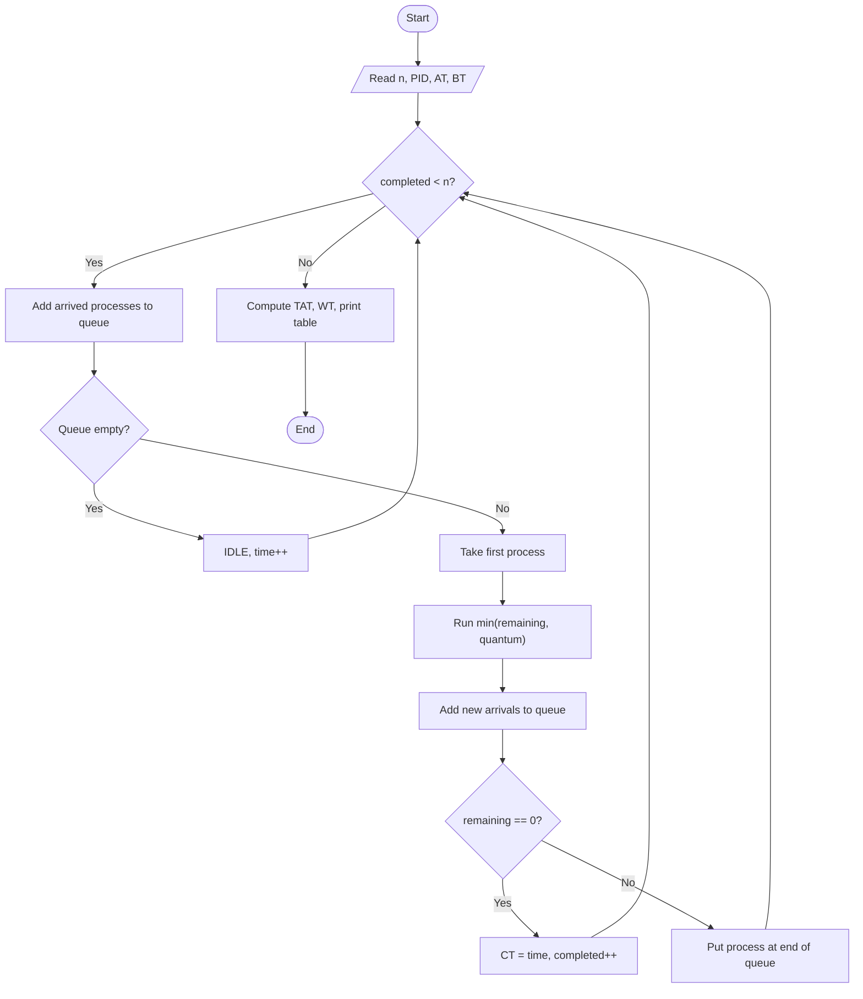

# Round Robin Scheduling

Each process runs for at most one time quantum (2). An unfinished process returns to the end of the queue.

```mermaid
flowchart TD
    A([Start]) --> B[/"Read n, PID, AT, BT"/]
    B --> C{"completed < n?"}
    C -- Yes --> D["Add arrived processes to queue"]
    D --> E{"Queue empty?"}
    E -- Yes --> F["IDLE, time++"]
    F --> C
    E -- No --> G["Take first process"]
    G --> H["Run min(remaining, quantum)"]
    H --> I["Add new arrivals to queue"]
    I --> J{"remaining == 0?"}
    J -- Yes --> K["CT = time, completed++"]
    J -- No --> L["Put process at end of queue"]
    K --> C
    L --> C
    C -- No --> M["Compute TAT, WT, print table"]
    M --> N([End])
```
