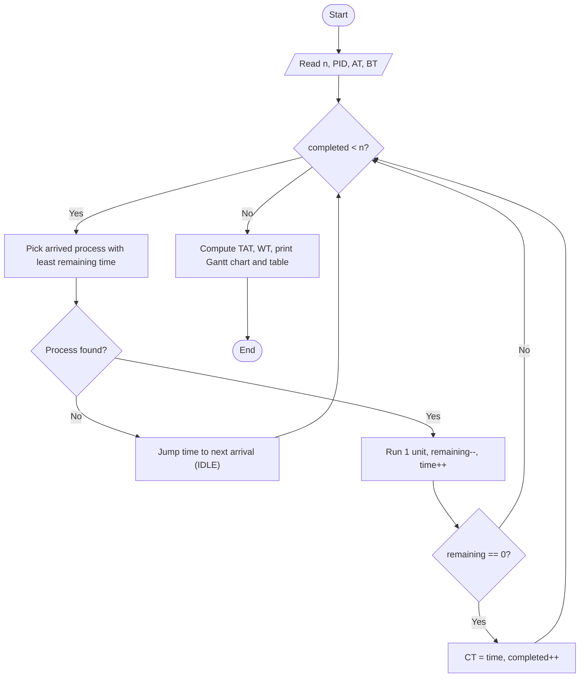

# SJF Preemptive (SRTF)

At each time unit, run the arrived process with the shortest remaining time. A new shorter process preempts the current one.

```mermaid
flowchart TD
    A([Start]) --> B[/"Read n, PID, AT, BT"/]
    B --> C{"completed < n?"}
    C -- Yes --> D["Pick arrived process with least remaining time"]
    D --> E{"Process found?"}
    E -- No --> F["Jump time to next arrival (IDLE)"]
    F --> C
    E -- Yes --> G["Run 1 unit, remaining--, time++"]
    G --> H{"remaining == 0?"}
    H -- Yes --> I["CT = time, completed++"]
    H -- No --> C
    I --> C
    C -- No --> J["Compute TAT, WT, print Gantt chart and table"]
    J --> K([End])
```
