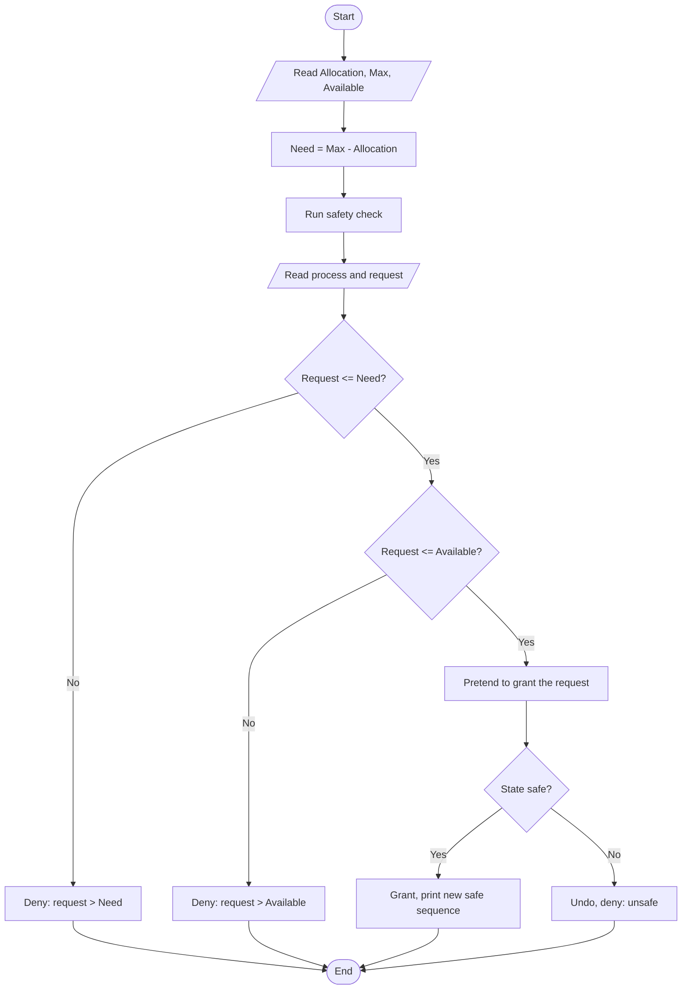

# Banker's Algorithm

Compute the Need matrix and check for a safe sequence. Grant a request only if the system stays safe.

```mermaid
flowchart TD
    A([Start]) --> B[/"Read Allocation, Max, Available"/]
    B --> C["Need = Max - Allocation"]
    C --> D["Run safety check"]
    D --> E[/"Read process and request"/]
    E --> F{"Request <= Need?"}
    F -- No --> X["Deny: request > Need"]
    F -- Yes --> G{"Request <= Available?"}
    G -- No --> Y["Deny: request > Available"]
    G -- Yes --> H["Pretend to grant the request"]
    H --> I{"State safe?"}
    I -- Yes --> J["Grant, print new safe sequence"]
    I -- No --> K["Undo, deny: unsafe"]
    X --> Z([End])
    Y --> Z
    J --> Z
    K --> Z
```
