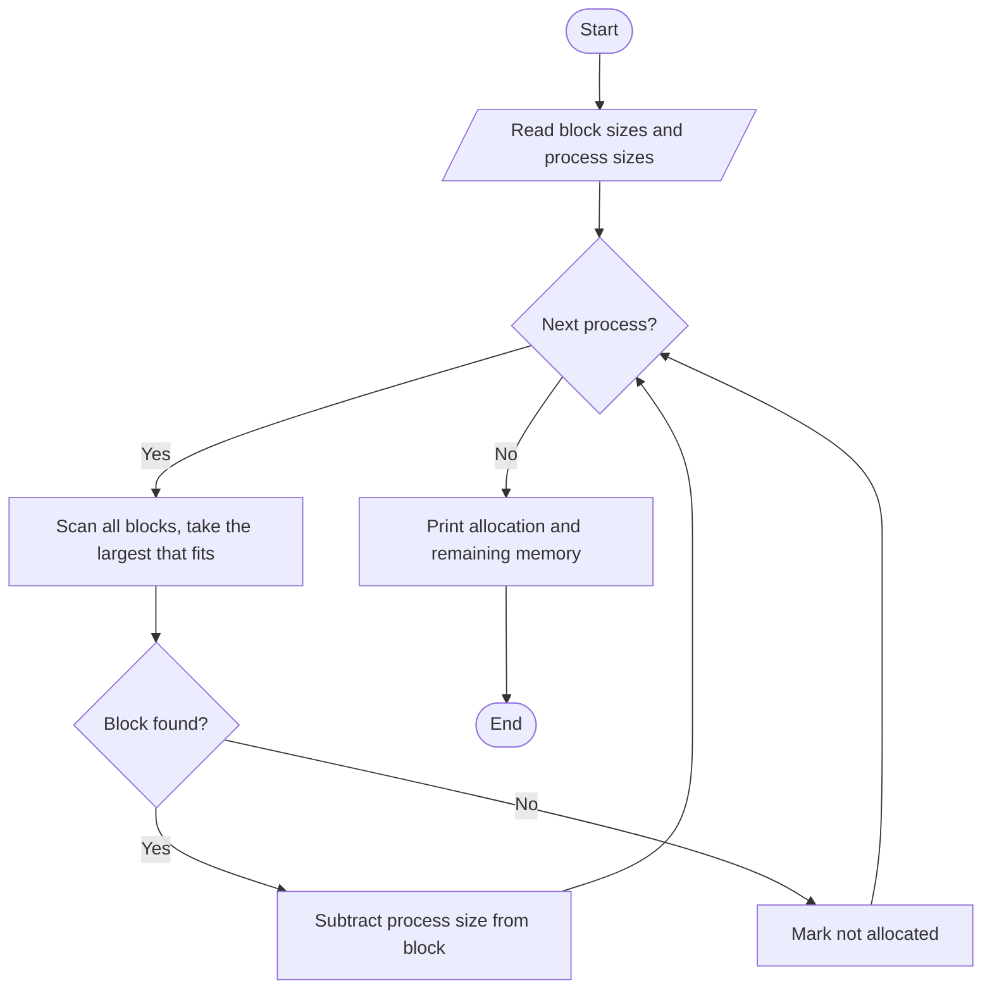

# Worst Fit

Give each process the largest block that is large enough.

```mermaid
flowchart TD
    A([Start]) --> B[/"Read block sizes and process sizes"/]
    B --> C{"Next process?"}
    C -- Yes --> D["Scan all blocks, take the largest that fits"]
    D --> E{"Block found?"}
    E -- Yes --> F["Subtract process size from block"]
    E -- No --> G["Mark not allocated"]
    F --> C
    G --> C
    C -- No --> H["Print allocation and remaining memory"]
    H --> I([End])
```
