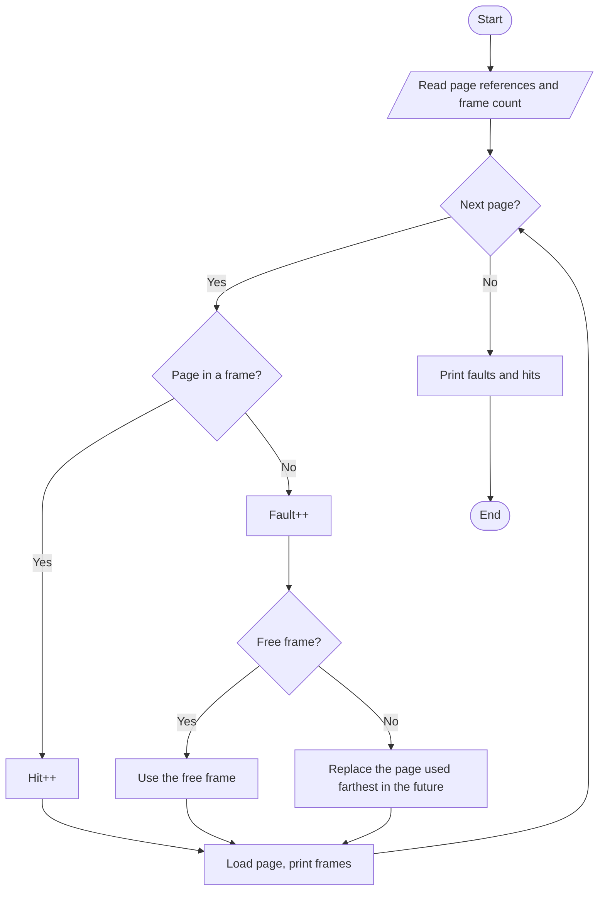

# Optimal Page Replacement

Replace the page whose next use is farthest in the future.

```mermaid
flowchart TD
    A([Start]) --> B[/"Read page references and frame count"/]
    B --> C{"Next page?"}
    C -- Yes --> D{"Page in a frame?"}
    D -- Yes --> E["Hit++"]
    D -- No --> F["Fault++"]
    F --> G{"Free frame?"}
    G -- Yes --> H["Use the free frame"]
    G -- No --> I["Replace the page used farthest in the future"]
    H --> J["Load page, print frames"]
    I --> J
    E --> J
    J --> C
    C -- No --> K["Print faults and hits"]
    K --> L([End])
```
