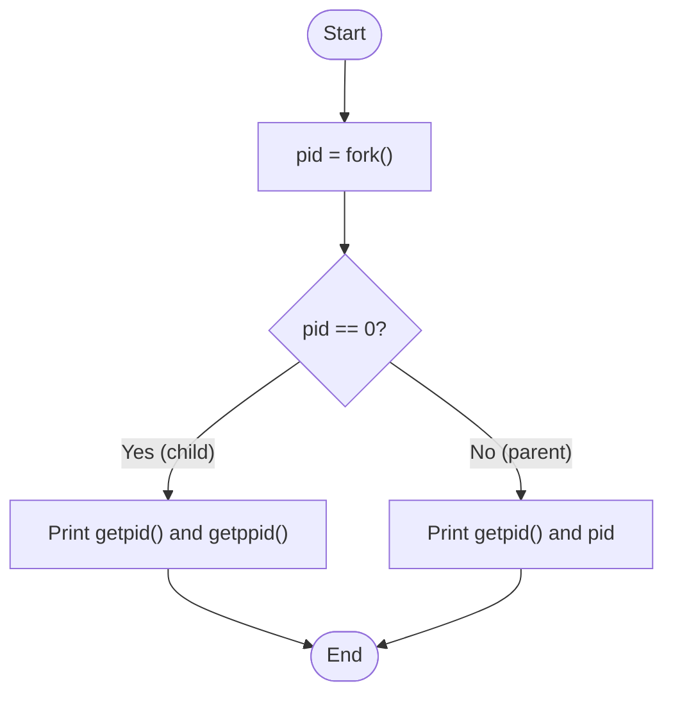

# fork()

Call fork(). The child prints its PID and the parent PID. The parent prints its PID and the child PID.

```mermaid
flowchart TD
    A([Start]) --> B["pid = fork()"]
    B --> C{"pid == 0?"}
    C -- "Yes (child)" --> D["Print getpid() and getppid()"]
    C -- "No (parent)" --> E["Print getpid() and pid"]
    D --> F([End])
    E --> F
```
