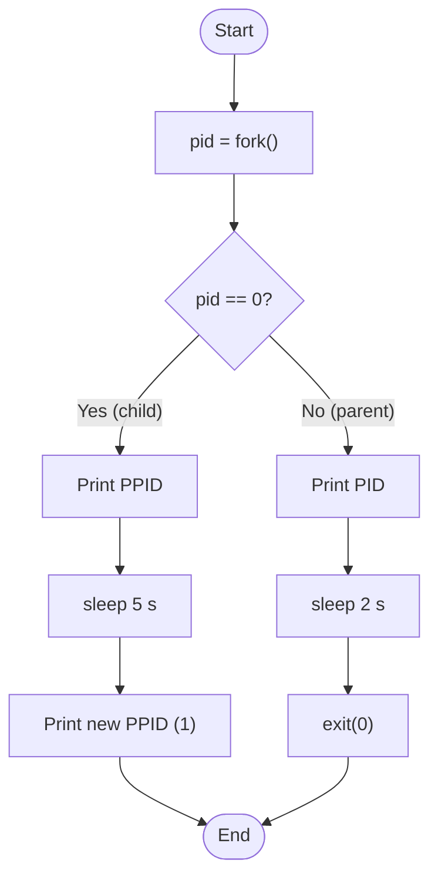

# Orphan Process

The parent exits while the child still runs. The system gives the child to init, so the PPID changes.

```mermaid
flowchart TD
    A([Start]) --> B["pid = fork()"]
    B --> C{"pid == 0?"}
    C -- "Yes (child)" --> D["Print PPID"]
    D --> E["sleep 5 s"]
    E --> F["Print new PPID (1)"]
    F --> K([End])
    C -- "No (parent)" --> G["Print PID"]
    G --> H["sleep 2 s"]
    H --> I["exit(0)"]
    I --> K
```
