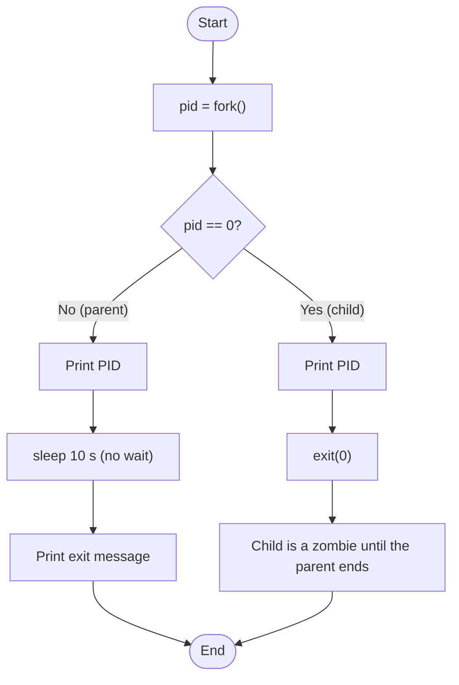

# Zombie Process

The child exits at once. The parent sleeps and does not call wait(). The child stays as a zombie.

```mermaid
flowchart TD
    A([Start]) --> B["pid = fork()"]
    B --> C{"pid == 0?"}
    C -- "Yes (child)" --> D["Print PID"]
    D --> E["exit(0)"]
    E --> Z["Child is a zombie until the parent ends"]
    C -- "No (parent)" --> F["Print PID"]
    F --> G["sleep 10 s (no wait)"]
    G --> H["Print exit message"]
    H --> I([End])
    Z --> I
```
