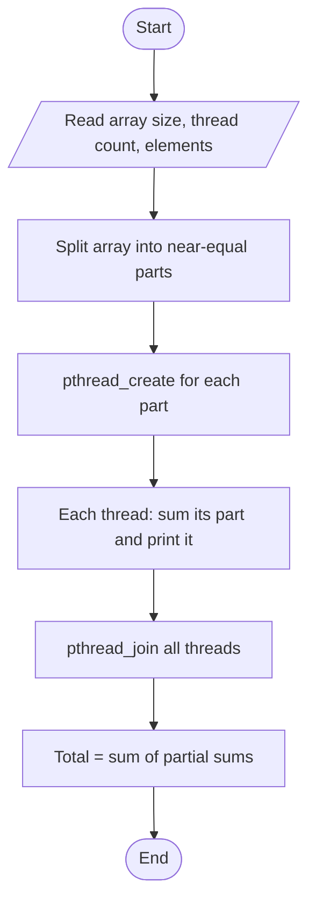

# Parallel Array Sum (pthreads)

Split the array into parts. Each thread sums one part. The main thread joins the threads and adds the partial sums.

```mermaid
flowchart TD
    A([Start]) --> B[/"Read array size, thread count, elements"/]
    B --> C["Split array into near-equal parts"]
    C --> D["pthread_create for each part"]
    D --> E["Each thread: sum its part and print it"]
    E --> F["pthread_join all threads"]
    F --> G["Total = sum of partial sums"]
    G --> H([End])
```
