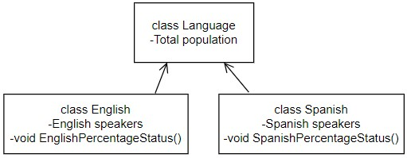

Single File Programming Question
Problem Statement

Help Manish write a program using classes to calculate the percentage of English and Spanish speakers and determine whether English or Spanish is the majority language. If either language constitutes 75% or more of the population, it is considered the majority language.

Classes Used:

class Language: contains total population as an attribute.
class English: derived from Language class, contains the number of English speakers and a method to calculate and display the percentage and majority status.
class Spanish: derived from Language class, contains the number of Spanish speakers and a method to calculate and display the percentage and majority status.

Refer to the below class diagram:

Input format :
The input consists of three integers separated by spaces representing the total population, English speakers, and Spanish speakers.

Output format :
The first line prints "English Percentage: " followed by a double value, representing the percentage of English speakers rounded to one decimal place.

The second line prints a statement indicating whether English is the majority language or not.

If the percentage of English speakers is equal to or greater than 75, the output prints "English is Majority!".
Otherwise, it prints "English is not Majority!".
The third line prints "Spanish Percentage: " followed by a double value, representing the percentage of Spanish speakers rounded to one decimal place.

The fourth line prints a statement indicating whether Spanish is the majority language or not.

If the percentage of Spanish speakers is equal to or greater than 75, the output prints "Spanish is Majority!".
Otherwise, it prints "Spanish is not Majority!".

Refer to the sample outputs for formatting specifications.

Code constraints :
1000 ≤ Total Population ≤ 108

English speakers + Spanish speakers = Total Population

Sample test cases :
Input 1 :
1000000 800000 200000
Output 1 :
English Percentage: 80.0%
English is Majority!
Spanish Percentage: 20.0%
Spanish is not Majority!
Input 2 :
50000 10000 40000
Output 2 :
English Percentage: 20.0%
English is not Majority!
Spanish Percentage: 80.0%
Spanish is Majority!
Input 3 :
1000000 578495 421505
Output 3 :
English Percentage: 57.8%
English is not Majority!
Spanish Percentage: 42.2%
Spanish is not Majority!
Input 4 :
1000 750 250
Output 4 :
English Percentage: 75.0%
English is Majority!
Spanish Percentage: 25.0%
Spanish is not Majority!