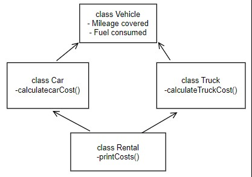

# Single File Programming Question

## Problem Statement

Help Sammy create a program to calculate rental costs for a car and a truck based on mileage and fuel consumption. The program defines three classes:

Vehicle class - Contains mileage covered and fuel consumed as attributes.
Car class - Derived from Vehicle class and calculates the total rental cost for the Car using calculateCarCost() method.
Truck class - Derived from Vehicle class and calculates the total rental cost for the Truck using calculateTruckCost() method.
Rental class - Derived from Car and Truck class and displays the rental costs for both vehicles using printCosts() method.

Formulas:

Car rental cost = 0.1*X + 2.0*Y
Truck rental cost = 1.5 * (0.1*A + 2.0*B)

Where X - Mileage covered by the Car; Y - Fuel consumed by the Car; A - Mileage covered by the Truck; B - Fuel consumed by the Truck.

Refer to the below class diagram:

### Input format :

The first line consists of a double value representing the mileage covered by the car.

The second line consists of a double value representing the fuel consumed by the car.

The third line consists of a double value representing the mileage covered by the truck.

The fourth line consists of a double value representing the fuel consumed by the truck.

### Output format :

The first line displays "Total Rental Cost for Car: " followed by the total rental cost for the car.

The second line displays "Total Rental Cost for Truck: " followed by the total rental cost for the truck.

The rental costs are double values that are rounded to two decimal places.

Refer to the sample outputs for the formatting specifications.

### Code constraints :

In this scenario, the test cases fall under the following constraints:

0 ≤ Mileage covered by car and truck ≤ 100

0 ≤ Fuel consumed by Car and Truck ≤ 50

### Sample test cases :

#### Input 1 :

25.5
12.5
45.0
18.0

#### Output 1 :

Total Rental Cost for Car: 27.55
Total Rental Cost for Truck: 60.75

#### Input 2 :

10.0
5.0
20.0
15.0

#### Output 2 :

Total Rental Cost for Car: 11.00
Total Rental Cost for Truck: 48.00

#### Input 3 :

5.5
2.0
10.0
5.0

#### Output 3 :

Total Rental Cost for Car: 4.55
Total Rental Cost for Truck: 16.50
