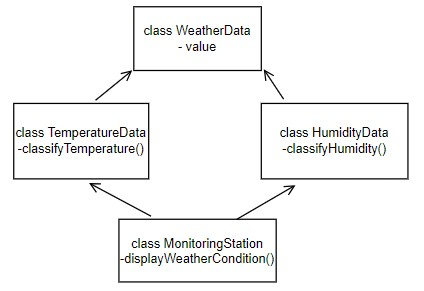

# Single File Programming Question

## Problem Statement

Sandeep wants to create a weather monitoring program that calculates the conditions based on user input and provides the final weather assessment. Help him write the program for the same.

The program has four classes:

class WeatherData - contains a data attribute to store a value for temperature.
classTemperatureData - derived from class WeatherData, classifies temperature as "Hot" if data is over 30.0 (exclusive) or "Cool" otherwise.
class HumidityData - derived from class WeatherData, classifies humidity as "Humid" if data is over 60.0 (exclusive) or "Dry" otherwise.
class MonitoringStation - inherits from TemperatureData and HumidityData classes to display temperature and humidity status.

Refer to the below class diagram:

### Input format :

The first line consists of a double value representing the temperature T in Celsius.

The second line consists of a double value representing the humidity H in percentage.

### Output format :

The output prints the weather condition based on the given criteria.

Refer to the sample output for formatting specifications

### Code constraints :

1.0 ≤ temperature, humidity ≤ 100.0

### Sample test cases :

#### Input 1 :

32.0
45.0

#### Output 1 :

Weather Condition: Hot and Dry

#### Input 2 :

28.5
70.0

#### Output 2 :

Weather Condition: Cool and Humid

#### Input 3 :

15.5
45.0

#### Output 3 :

Weather Condition: Cool and Dry

#### Input 4 :

35.0
75.0

#### Output 4 :

Weather Condition: Hot and Humid
