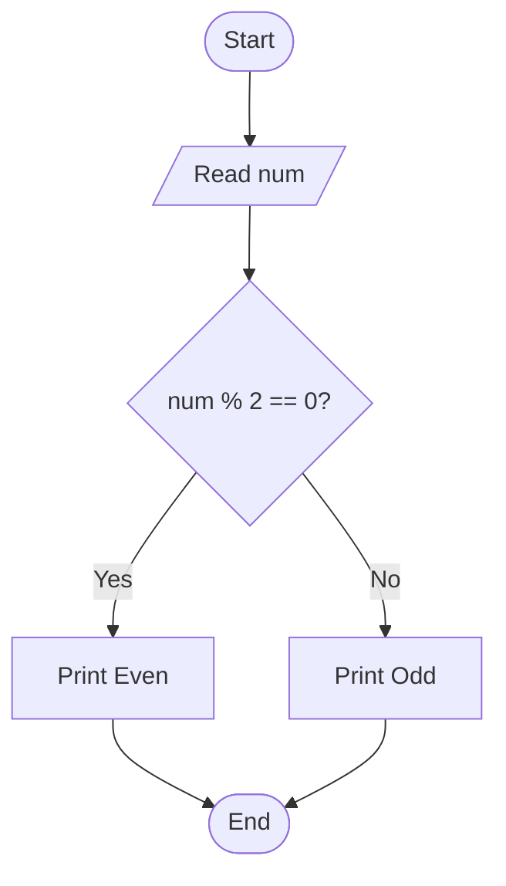

# Even or Odd

Read a number. Divide it by 2. A remainder of 0 means even.

```mermaid
flowchart TD
    A([Start]) --> B[/Read num/]
    B --> C{"num % 2 == 0?"}
    C -- Yes --> D[Print Even]
    C -- No --> E[Print Odd]
    D --> F([End])
    E --> F
```
