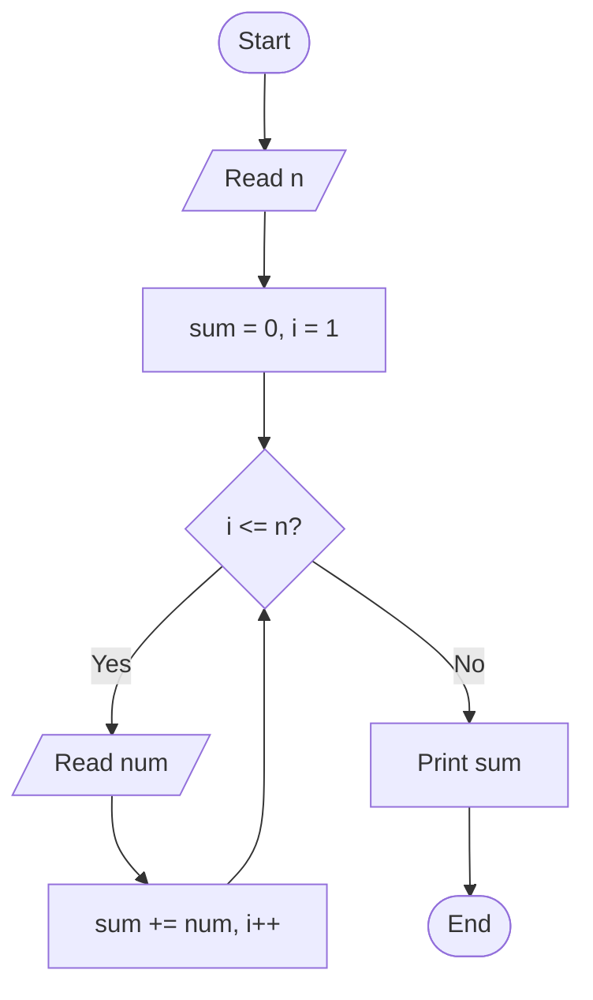

# Sum of N Numbers

Read n. Read n numbers in a loop. Add each number to the sum.

```mermaid
flowchart TD
    A([Start]) --> B[/Read n/]
    B --> C["sum = 0, i = 1"]
    C --> D{"i <= n?"}
    D -- Yes --> E[/Read num/]
    E --> F["sum += num, i++"]
    F --> D
    D -- No --> G[Print sum]
    G --> H([End])
```
